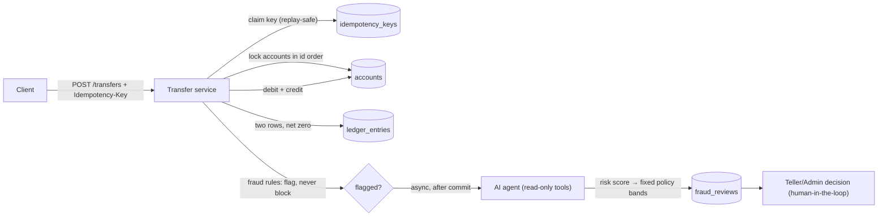

# SecureTransfer API

[](https://github.com/hollywood-an/securetransfer-api/actions/workflows/ci.yml)
[](https://github.com/hollywood-an/securetransfer-api/actions/workflows/codeql.yml)

A banking transactions backend built to be **correct under the conditions that
actually matter in finance** — and then **adversarially tested to prove it**.
Java 25 · Spring Boot 3.5 · PostgreSQL.

## 🚀 Live demo

**[securetransfer-demo.vercel.app](https://securetransfer-demo.vercel.app)** — a teller
console for the API: login, account dashboard + ledger, transfers, and the AI
**fraud-review queue**. Sign in with the public demo staff login:

| Username | Password |
|----------|----------|
| `demo`   | `demopass123` |

Then: **Seed demo** (creates a customer + two accounts) → send a transfer of
**≥ $10,000** to trip a fraud flag → watch it land in **Fraud reviews** with the
AI's score, reasoning, and your Approve / Hold / Escalate call.

_(The `demo` login is an intentionally-public **TELLER** — it can't freeze accounts,
read the audit log, or manage users. The backend is on Render's free tier, so the
first request after idle cold-starts in ~30–60s.)_

**Raw API:** [`securetransfer-api.onrender.com`](https://securetransfer-api.onrender.com)
(JSON only — `GET /` returns `401`; start with `/auth/**`).

## Why this isn't another CRUD banking app

- **Atomic double-entry money movement** — every transfer debits, credits, and writes two ledger rows that net to zero, inside one transaction; the ledger and audit log are append-only.
- **Concurrency-safe by construction** — pessimistic row locks (`SELECT … FOR UPDATE`) acquired in ascending account-id order, so opposing transfers can't deadlock and no balance can be corrupted by a race.
- **Idempotent payments as a real protocol** — `Idempotency-Key` required on every transfer; replays return the stored result, an in-flight duplicate gets `409`, and reusing a key with a *different body* is rejected.
- **AI fraud triage with hard guardrails** — an Anthropic-SDK agent investigates flagged transfers with **read-only tools**, its score maps to an action through a **deterministic policy** (never the model's whim), and a human always makes the final call.
- **70 tests across 17 classes** — including Testcontainers integration suites that assert both the HTTP response *and* the resulting database state (exact balances, ledger rows netting to zero) against a real Postgres.
- **CI-gated delivery** — every PR must pass the full suite (required status check) before merge; merges to `master` deploy to Render. Dependabot + CodeQL run continuously.

## 🔍 I red-teamed my own fraud agent

I drove **13 live transfers** — including planted laundering patterns (a $1
probe-then-drain, sub-$10k structuring, a round-trip) — through the deployed
API to trigger **10 real AI reviews**, then audited every verdict with an
adversarial evaluation. It found **3 real weaknesses**:

1. the agent **missed structuring** entirely (scored textbook smurfing 25/APPROVE),
2. it **hallucinated "overdrafts"** from a post-debit balance artifact,
3. its **score→action mapping was unstable** (the same score produced different actions).

All three are **fixed via CI-gated PRs and re-verified live** — the same drain
that once produced a fabricated overdraft now reasons *"moves 98% of sender's
balance… fund drainage,"* and structuring now scores 92/ESCALATE.

**→ Full writeup: [`docs/fraud-agent-evaluation.md`](./docs/fraud-agent-evaluation.md)**
(methodology, per-verdict scorecard, findings, and honest limits).

## How a transfer works



## Stack
- **Java 25**, **Spring Boot 3.5** (Web, Data JPA, Security, Validation)
- **PostgreSQL 16** (local via Docker Compose) · **Flyway** migrations
- **JUnit 5 + Testcontainers** integration tests
- **Gradle** build · **Docker + GitHub Actions** CI/CD · **Render** hosting
- **Anthropic SDK** for the fraud-triage agent

## API endpoints
All endpoints except `/auth/**` require a JWT: log in, then send
`Authorization: Bearer <token>` on each request.

| Method | Path             | Access       | Purpose                                        |
|--------|------------------|--------------|------------------------------------------------|
| POST   | `/auth/register` | public       | Self-service signup (creates a CUSTOMER)       |
| POST   | `/auth/login`    | public       | Log in → returns a signed JWT                  |
| POST   | `/customers`     | TELLER/ADMIN | Create a customer record                       |
| POST   | `/accounts`      | TELLER/ADMIN | Open an account for a customer                 |
| GET    | `/accounts/{id}` | owner/staff  | Balance + ledger (CUSTOMER: own accounts only) |
| POST   | `/transfers`     | owner/staff  | Move money (CUSTOMER: from own account only)   |
| GET    | `/admin/users`   | ADMIN        | List login accounts                            |
| POST   | `/admin/accounts/{id}/freeze`   | ADMIN | Freeze an account (blocks its transfers) |
| POST   | `/admin/accounts/{id}/unfreeze` | ADMIN | Return an account to normal service      |
| GET    | `/audit`         | ADMIN        | Audit log — filter by actor/action/date, paginated |
| GET    | `/fraud-reviews`               | TELLER/ADMIN | Review queue (filter by `status`, paginated) |
| GET    | `/fraud-reviews/{id}`          | TELLER/ADMIN | One review (rules + agent verdict)           |
| POST   | `/fraud-reviews/{id}/decision` | TELLER/ADMIN | Record the human decision (APPROVE/HOLD/ESCALATE) |

Unauthenticated → `401`; authenticated but not allowed → `403`.

Sensitive actions are recorded in an **append-only audit log** (separate from the
money ledger): account freeze/unfreeze and staff viewing a customer's account.
The actor is always the authenticated user, never client-supplied. A transfer
touching a **frozen** account is rejected with `409`.

### Transfers: idempotency & concurrency
`POST /transfers` **requires an `Idempotency-Key` header** (`400` if missing).
The first request with a key processes the transfer and stores its response; a
repeat of the same key replays that stored response without moving money again
(`409` if the first is still in progress, or if the key is reused with a
different body). Transfers are atomic (`@Transactional`), use pessimistic row
locking (`SELECT … FOR UPDATE`, accounts locked in id order to avoid deadlocks),
and write two double-entry ledger rows that net to zero. Errors: `404` unknown
account, `422` insufficient funds, `400` invalid request (same-account,
non-positive amount, cross-currency, or missing key).

### Fraud triage
Cheap deterministic rules **flag** (never block) a transfer — large amount, high
velocity, brand-new payee, or **structuring** (repeated just-under-threshold
sends) — marking it `FLAGGED`; the money still moves. An **async** review then
runs an AI agent (Anthropic SDK) given **three read-only tools** (`get_account`,
`get_transaction_history`, `get_velocity_stats`) that returns a `risk_score`
(0–100) and reasoning, from which a **fixed policy** derives the
`recommended_action` (≥70 ESCALATE, ≥40 HOLD, else APPROVE) — the same score
always maps to the same action. The verdict is persisted to `fraud_reviews` and
`audit_log`. **Guardrails:** the agent's tools are strictly read-only (it can
look, never move money); it only *recommends*; a TELLER/ADMIN records the final
decision (human-in-the-loop); its JSON output is validated before use; a
structuring flag can never be auto-approved; and with no API key it degrades to
a deterministic rules-based verdict. The API key is read from the environment
and never logged.

A ready-to-run Postman collection is in
[`postman/SecureTransfer.postman_collection.json`](./postman/SecureTransfer.postman_collection.json)
(run the requests top-to-bottom; it chains the created ids automatically).

## Frontend
A small **Vite + React** teller console lives in [`frontend/`](./frontend) — a face
for the API with four screens: login, account dashboard (balance + ledger),
transfer (success + rejected states), and the **fraud-review queue** with the AI
verdict and approve/hold/escalate (human-in-the-loop). Run it with
`cd frontend && npm install && npm run dev`. Browsers require the backend to
allow the frontend's origin — the backend permits `http://localhost:5173` by
default (`app.cors.allowed-origins`); set `CORS_ALLOWED_ORIGINS` to add a
deployed frontend URL.

## CI/CD & security scanning
- **`.github/workflows/ci.yml`** — on every pull request: runs the full test
  suite (Testcontainers spins up a real Postgres on the runner) and verifies the
  Docker image builds. The **Build & test** job is a required status check on
  `master`, so a red build blocks the merge.
- **`.github/workflows/deploy.yml`** — on push to `master`: re-runs the tests,
  then **verifies the deploy** — polls the live service until `/actuator/info`
  reports the exact pushed commit (via Render's `RENDER_GIT_COMMIT`) and
  `/actuator/health` is `UP`, so a broken or hung deploy fails the workflow loudly.
- **Health checks** — `/actuator/health` (public) backs Render's `healthCheckPath`,
  so a failed startup or a lost DB connection marks the deploy unhealthy instead of
  silently serving errors.
- **`.github/workflows/codeql.yml`** — CodeQL static security analysis on every
  push/PR and weekly.
- **`.github/dependabot.yml`** — weekly dependency updates (Gradle, Actions,
  npm), each gated by CI.
- **`Dockerfile`** — multi-stage build (JDK 25 builder → JRE 25 runtime, non-root).
- **`render.yaml`** — a Render Blueprint: a Docker web service + managed
  Postgres, with DB env vars wired automatically and `JWT_SECRET` generated.

## Getting started

Prerequisites: JDK 25 and Docker Desktop (running).

```bash
# 1. Create your local secrets file from the template
cp .env.example .env          # then set DB_PASSWORD, JWT_SECRET, ADMIN_PASSWORD, TELLER_PASSWORD

# 2. Start PostgreSQL (exposed on localhost:5433 to avoid clashing with any
#    Postgres already running on the standard 5432)
docker compose up -d

# 3. Run the app (it reads DB_PASSWORD from the environment).
set -a; source .env; set +a
./gradlew bootRun

# 4. Run the tests (spins up a throwaway Postgres via Testcontainers)
./gradlew test
```

On startup, Flyway applies the migrations in
`src/main/resources/db/migration` and the app connects to Postgres.

## Configuration
Secrets come from the environment, never from committed files:

| Variable            | Used by                        | Notes                                          |
|---------------------|--------------------------------|------------------------------------------------|
| `DB_PASSWORD`       | docker-compose **and** the app | Local Postgres password                        |
| `JWT_SECRET`        | the app                        | Signing key for login tokens; **≥ 32 chars**   |
| `ADMIN_PASSWORD`    | the app                        | Password for the seeded `admin` login          |
| `TELLER_PASSWORD`   | the app                        | Password for the seeded `teller` login         |
| `ANTHROPIC_API_KEY` | the app                        | **Optional** — fraud agent; blank → fallback   |
| `CORS_ALLOWED_ORIGINS` | the app                     | **Optional** — frontend origins; default `localhost:5173` |

The first four are **required** (no committed defaults) — the app fails fast if
any is unset. On first startup it seeds two staff logins, `admin` and `teller`,
using `ADMIN_PASSWORD` / `TELLER_PASSWORD`. Public `POST /auth/register` only
ever creates CUSTOMER accounts. `ANTHROPIC_API_KEY` is optional: if blank, the
fraud-triage agent runs in a deterministic **rules-based fallback** mode (no
model call), so everything still works end-to-end.

For a deployed host, `DB_HOST` / `DB_PORT` / `DB_NAME` / `DB_USERNAME` override
the local defaults (the app composes the JDBC URL from them), and `PORT` (set by
the platform) overrides the server port.

## Database schema
- `V1__init.sql` — six tables: `accounts`, `idempotency_keys`, `transfers`,
  `ledger_entries`, `audit_log`, `fraud_reviews`.
- `V2__customers_and_account_constraints.sql` — adds the `customers` table and
  the `accounts → customers` foreign key.
- `V3__users.sql` — adds the `users` table (login accounts: BCrypt password,
  role, optional `customer_id` link).
- `V4__account_status.sql` — adds `accounts.status` (ACTIVE/FROZEN) for the
  admin freeze feature.
- `V5__fraud_reviews_workflow.sql` — extends `fraud_reviews` with the review
  workflow (status, flag reasons, agent model, and the human decision).

Money is `NUMERIC(19,4)`; the ledger and audit log are append-only.

## Project status
Built as a portfolio flagship project, developed in phases, one at a time:

- [x] **Phase 0** — Project scaffold, Docker Postgres, Flyway schema (6 tables)
- [x] **Phase 1** — Customers & accounts (create + read balance/ledger)
- [x] **Phase 2** — Atomic, concurrency-safe transfers (double-entry ledger)
- [x] **Phase 3** — Idempotency (Idempotency-Key replay protection)
- [x] **Phase 4** — Auth & RBAC (JWT login, roles, ownership checks)
- [x] **Phase 5** — Audit log (append-only; account freeze; admin `GET /audit`)
- [x] **Phase 6** — Agentic fraud triage (read-only agent, human-in-the-loop)
- [x] **Phase 7** — Integration tests (Testcontainers; HTTP + DB-state assertions)
- [x] **Phase 8** — CI/CD (GitHub Actions test gate; Docker image; Render deploy)
- [x] **Phase 9** — Vite + React demo frontend (see [`frontend/`](./frontend))
- [x] **Post-launch** — Red-teamed the fraud agent; found & fixed 3 weaknesses ([writeup](./docs/fraud-agent-evaluation.md))
